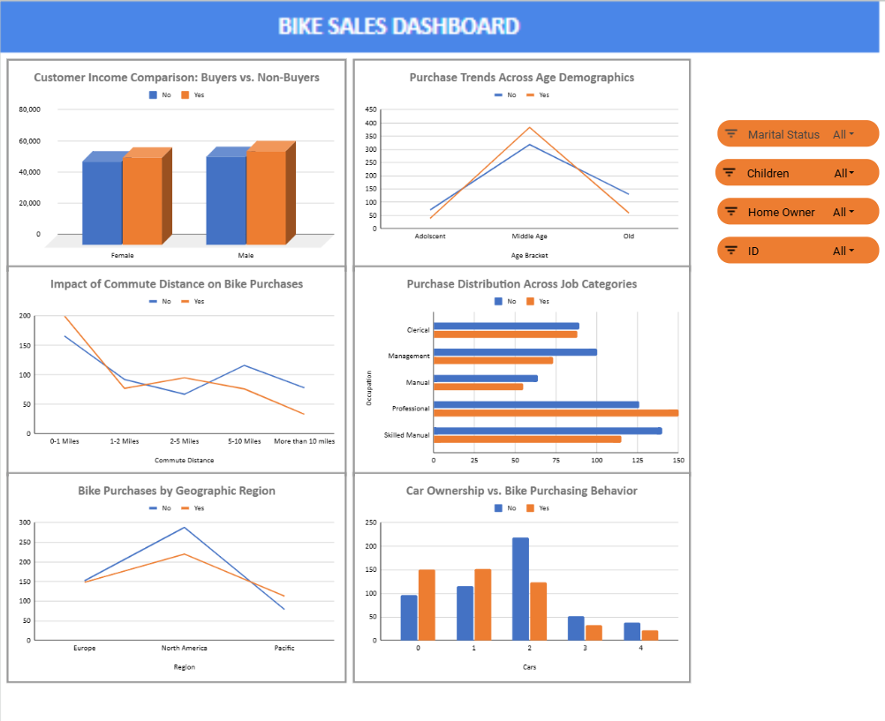

# 🚴 Bike Sales Analysis & Interactive Dashboard

An end-to-end data analysis project exploring customer demographics and purchasing behaviors for a bike retail business. Built using spreadsheet pivot tables, dynamic charts, and interactive slicers.

---

## 📊 Dashboard Preview



---

## 🎯 Project Overview & Objectives

The goal of this project is to analyze customer demographic attributes (income, age, commute distance, occupation, car ownership, and geographic region) to understand the key drivers influencing whether a customer purchases a bicycle. 

### Key Business Questions:
1. Does average customer income impact bicycle purchases across genders?
2. Which age demographics represent the highest conversion rates?
3. How does commute distance affect the likelihood of buying a bike?
4. What role do car ownership, region, and job occupation play in purchase decisions?

---

## 🛠️ Data Pipeline & Methodology

1. **Data Inspection & Cleaning:**
   - Evaluated 1,000+ customer records for duplicates, missing values, and formatting inconsistencies.
   - Standardized categorical variables (`Marital Status`, `Gender`, `Purchased Bike`).
2. **Feature Engineering:**
   - Created categorical **Age Brackets** (`Adolescent`, `Middle Age`, `Old`) using conditional logic formulas.
3. **Data Summarization & Analysis:**
   - Generated dedicated Pivot Tables summarizing:
     - Average income by gender and purchase status.
     - Customer count by age demographic.
     - Commute distance distributions.
     - Purchases segmented by occupation, region, and car ownership.
4. **Interactive Dashboard Design:**
   - Visualized findings using a combination of grouped column charts, multi-line trend charts, and horizontal bar charts.
   - Integrated dynamic slicers (`Marital Status`, `Children`, `Home Owner`, `ID`) for real-time exploratory filtering.

---

## 💡 Key Insights & Findings

* **Income Disparity:** Customers who purchased bikes tend to have higher average incomes across both male and female segments.
* **Core Age Demographic:** The **Middle Age** group (31–54) represents the vast majority of bike buyers (383 buyers vs. 318 non-buyers).
* **Commute Distance Impact:** Customers with short commutes (**0–1 Miles**) show the highest purchase volume, whereas conversion drops significantly for commutes exceeding 10 miles.
* **Car Ownership Inverse Relationship:** Customers owning **0 to 1 cars** are substantially more likely to purchase bicycles compared to those owning 2 or more vehicles.
* **Occupational Patterns:** **Professionals** and **Skilled Manual** workers constitute the largest customer base of bike purchasers.

---

## 📂 Repository Contents

| File / Folder | Description |
| :--- | :--- |
| `bike_sales_dashboard.xlsx` | Interactive workbook containing raw data, cleaning steps, pivot tables, and dashboard |
|  `bike_buyers_raw.csv` | Raw dataset |
| `bike-dashboard.png`  |  Dashboard preview screenshot used in documentation |

---

## 🚀 How to Explore

1. Clone or download this repository:
   ```bash
   git clone https://github.com/your-username/bike-sales-dashboard.git
